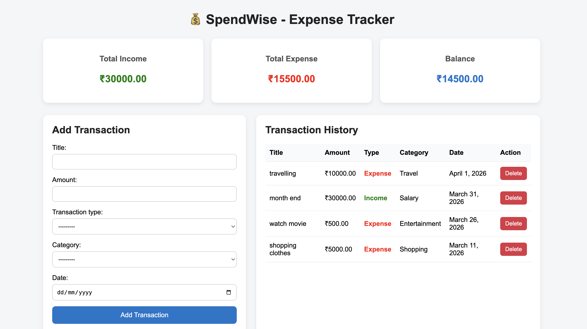
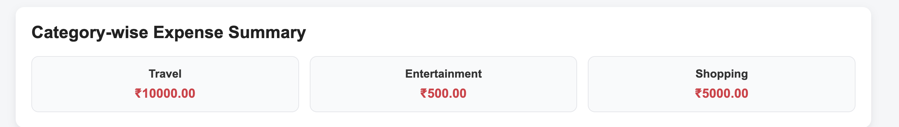

# SpendWise – Personal Finance Tracker 💰

**SpendWise** is a simple yet powerful web application to help you track your expenses and manage your personal finances efficiently. Keep your spending organized, visualize your expenses, and make informed financial decisions — all in one place!

---

##  Features

- Add, view, and delete transactions with ease.
- Categorize expenses for better analysis.
- Responsive dashboard showing your spending summary.
- User-friendly interface for quick navigation.
- Secure and lightweight Django-based backend.

---

##  Technology Stack

- Frontend: HTML, CSS, Bootstrap
- Backend: Django 5.2
- Database: SQLite (development)
- Version Control: Git & GitHub

---

##  Installation

1. **Clone the repository**
git clone https://github.com/akriti311/spendwise-finance-tracker.git
cd spendwise-finance-tracker

2. **Create a virtual environment**
python3 -m venv venv
source venv/bin/activate  # Mac/Linux
venv\Scripts\activate     # Windows

3. **Install dependencies**
pip install -r requirements.txt

4. **Run migrations**
python manage.py migrate

5. **Start the development server**
python manage.py runserver

6. **Open in browser**
http://127.0.0.1:8000/

---

##  Screenshots

### Home Page

### Add Transaction

---

##  Usage

- Add your daily expenses.
- Categorize them (Food, Shopping, Travel, etc.).
- View summary and total spending.
- Delete transactions when needed.

---

## Contributing

1. Fork the repository.
2. Create your feature branch: `git checkout -b feature/AmazingFeature`
3. Commit your changes: `git commit -m 'Add some feature'`
4. Push to the branch: `git push origin feature/AmazingFeature`
5. Open a Pull Request.