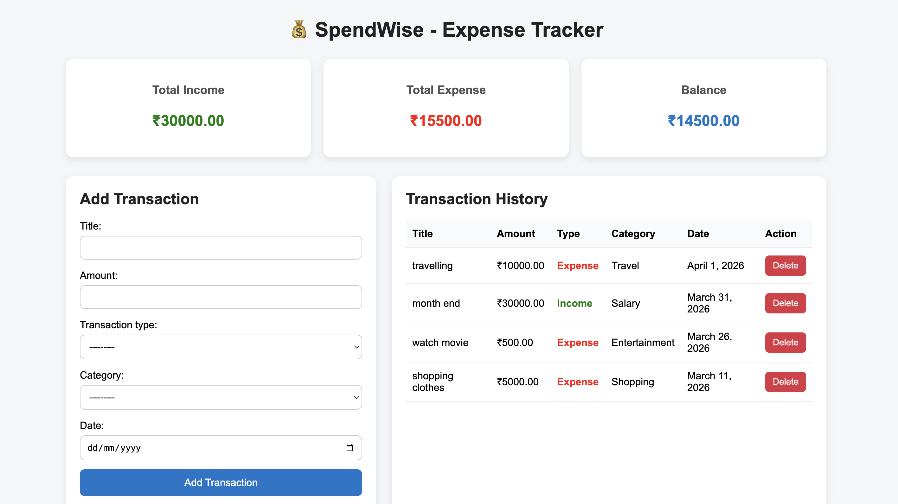
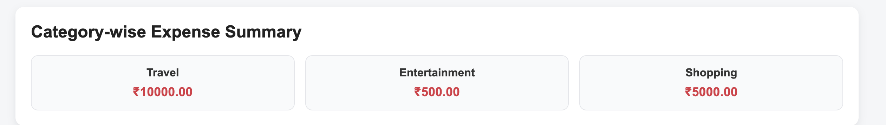

# SpendWise – Personal Finance Tracker

**SpendWise** is a Django web app to track income and expenses. Each user has a private account and sees only their own transactions, with totals and category-wise summaries on a simple dashboard.

---

## Features

- **User authentication** — Sign up, log in, and log out (Django built-in auth)
- **Private transactions** — Every transaction is tied to the logged-in user; users cannot view or delete each other's data
- **Transaction management** — Add, view, and delete income/expense entries
- **Categories** — Food, Travel, Bills, Shopping, Entertainment, Health, Salary, and more
- **Dashboard** — Total income, total expense, balance, transaction history, and category-wise expense summary
- **PostgreSQL** — Production-friendly database with configuration via environment variables (`.env`)

---

## Technology Stack

| Layer | Technology |
|-------|------------|
| Frontend | HTML, CSS |
| Backend | Django 5.2 |
| Database | PostgreSQL (`psycopg2-binary`) |
| Config | `python-dotenv` (`.env` files) |
| Version control | Git & GitHub |

---

## Prerequisites

- Python 3.10+
- PostgreSQL 14+ (Homebrew on Mac, or system install on Linux)
- Git

**Port note:** SpendWise is configured to use PostgreSQL on port **5433** so port **5432** stays free for other local projects (for example GraphSpace in Docker). You can change `DB_PORT` in `.env` if needed.

---

## Installation

### 1. Clone the repository

```bash
git clone https://github.com/akriti311/spendwise-finance-tracker.git
cd spendwise-finance-tracker
```

### 2. Create and activate a virtual environment

```bash
python3 -m venv venv
source venv/bin/activate   # Mac/Linux
# venv\Scripts\activate    # Windows
```

### 3. Install dependencies

```bash
pip install -r requirements.txt
```

### 4. Set up PostgreSQL

**Mac (Homebrew) example**

Install PostgreSQL if needed, then set it to listen on port **5433** (edit `postgresql.conf`, typically at `/opt/homebrew/var/postgresql@14/postgresql.conf`):

```conf
port = 5433
```

Start the service:

```bash
brew install postgresql@14
brew services start postgresql@14
```

Create the database:

```bash
createdb -p 5433 spendwise
```

**Linux / Docker**

Use your normal PostgreSQL setup; set `DB_PORT=5432` (or your mapped port) in `.env`.

### 5. Configure environment variables

```bash
cp .env.example .env
```

Edit `.env` for your machine. Example for local development on Mac (Homebrew):

```env
SECRET_KEY=your-long-random-secret-key
DEBUG=True
ALLOWED_HOSTS=localhost,127.0.0.1

DB_NAME=spendwise
DB_USER=
DB_PASSWORD=
DB_HOST=localhost
DB_PORT=5433
```

| Variable | Description |
|----------|-------------|
| `SECRET_KEY` | Django secret key (required in production) |
| `DEBUG` | `True` for development, `False` for production |
| `ALLOWED_HOSTS` | Comma-separated hostnames (e.g. `localhost,127.0.0.1`) |
| `DB_NAME` | PostgreSQL database name |
| `DB_USER` | DB user (empty on Mac Homebrew → uses your macOS username) |
| `DB_PASSWORD` | DB password (often empty for local Homebrew) |
| `DB_HOST` | Database host |
| `DB_PORT` | Database port (`5433` for this project by default) |

Never commit `.env` — it is listed in `.gitignore`.

### 6. Run migrations

```bash
python manage.py migrate
```

### 7. Start the development server

```bash
python manage.py runserver
```

Open **http://127.0.0.1:8000/** in your browser.

### 8. Create an account

1. Go to **Sign Up** and create a user.
2. You are logged in automatically and land on the dashboard.
3. Add transactions — they are saved to PostgreSQL and linked to your account only.

---

## Usage

1. **Sign up** or **log in** from the navigation bar.
2. **Add a transaction** — title, amount, type (Income/Expense), category, and date.
3. **Review the dashboard** — income, expense, balance, and category breakdown.
4. **Delete** entries you no longer need (only your own rows).
5. **Log out** when finished (POST-based logout for security).

---

## Running tests

Tests use an in-memory SQLite database so you do not need PostgreSQL running for the test suite:

```bash
python manage.py test tracker
```

---

## Project structure

```
spendwise/
├── core/                 # Django project settings & URLs
│   ├── settings.py       # App config, PostgreSQL, auth redirects, .env loading
│   └── urls.py
├── tracker/              # Main app
│   ├── models.py         # Transaction model (with user FK)
│   ├── views.py          # Auth + dashboard + delete
│   ├── forms.py          # Transaction form
│   ├── urls.py
│   └── templates/tracker/
├── .env.example          # Environment variable template (copy to .env)
├── requirements.txt
└── manage.py
```

---

## Screenshots

### Home Page



### Category-wise expense summary



---

## Production notes

- Set `DEBUG=False` and a strong `SECRET_KEY` in `.env`.
- Set `ALLOWED_HOSTS` to your domain.
- Use `DB_CONN_MAX_AGE=60` and `DB_SSLMODE=require` for hosted PostgreSQL.
- Serve Django with a production WSGI server (e.g. Gunicorn), not `runserver`.

---

## Contributing

1. Fork the repository.
2. Create a feature branch: `git checkout -b feature/your-feature`
3. Commit your changes: `git commit -m 'Add your feature'`
4. Push to the branch: `git push origin feature/your-feature`
5. Open a Pull Request.
